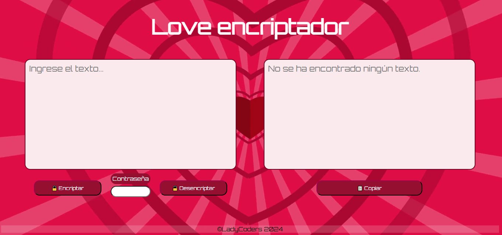

# 
🔏 Love Encriptador 

 

   

## 
 📃 Resumen 

#### Este proyecto tiene como objetivo crear una página web que permita a los usuarios cifrar y descifrar texto. El propósito principal es ofrecer un método de comunicación novedoso, especialmente diseñado para personas que desean expresar sus sentimientos de manera cifrada. Esta herramienta puede ser útil para enviar mensajes encriptados de forma segura, agregando un toque de misterio y diversión a la comunicación.

   

## 
 📋 Funcionalidades 

* Cifrado de Texto: Los usuarios pueden ingresar un texto en la página web, seleccionar un desplazamiento (en el caso de un cifrado César) y ver el texto transformado en su forma cifrada. </li>
* Descifrado de Texto: De manera similar, los usuarios pueden ingresar un texto cifrado y descifrarlo utilizando la contraseña correcta para revelar el mensaje original.</li>

   

## 
 🚀 Despliegue 

#### Puedes ver el proyecto desplegado en este [enlace](https://github.com/bymichelleah/encriptador.ct/).

   

# ✅ Guía de Usuario

## 1. Ingresar Contraseña

Antes de usar las funciones de encriptar o desencriptar, necesitas ingresar una contraseña. Esta contraseña será la misma para ambas operaciones.

- **Ubicación**: En el campo de texto ubicado entre los botones **[ ENCRIPTAR ]** y **[ DESENCRIPTAR ]**.
- **Cómo Usarlo**:
  1. Introduce una contraseña.
  2. Asegúrate de recordar la contraseña, ya que la necesitarás para desencriptar el mensaje más tarde.

## 2. Encriptar

- **Descripción**: La función de encriptar convierte tu mensaje en un formato codificado para protegerlo de accesos no autorizados.
- **Cómo Usarlo**:
  1. Ingresa el mensaje que deseas encriptar en el campo de texto designado.
  2. Asegúrate de haber ingresado la contraseña en el campo correspondiente.
  3. Haz clic en el botón **"Encriptar"**.
  4. El mensaje encriptado aparecerá en el área designada en la página.

## 3. Desencriptar

- **Descripción**: La función de desencriptar convierte un mensaje encriptado de nuevo a su formato original usando la contraseña que ingresaste.
- **Cómo Usarlo**:
  1. Ingresa el mensaje encriptado en el campo de texto designado.
  2. Asegúrate de haber ingresado la misma contraseña que usaste para encriptar el mensaje.
  3. Haz clic en el botón **"Desencriptar"**.
  4. El mensaje desencriptado aparecerá en el área designada en la página.

## 4. Copiar

- **Descripción**: La función de copiar te permite copiar el mensaje encriptado o desencriptado para que lo puedas pegar en otro lugar.
- **Cómo Usarlo**:
  1. Una vez que el mensaje encriptado o desencriptado aparece en la página, haz clic en el botón **"Copiar"**.
  2. El mensaje se copiará al portapapeles y podrás pegarlo donde desees.

## Consejos de Seguridad

- **Contraseña Segura**: Utiliza contraseñas únicas para asegurar tus mensajes.
- **No Compartir Contraseña**: No compartas tu contraseña con otras personas para mantener la confidencialidad de tus mensajes.

   

## 
 🔨  Stack 

####   

 

## 
 📋 Fue creado por: 

* Mishell Arroyo
* Luciana Carrasco
* Michelle Alanya